# ROS2 Turtle Controller

## 1. Introdução

Projeto desenvolvido utilizando ROS 2 Humble com objetivo de criar um sistema distribuído de controle de movimentação utilizando comunicação entre nós através de tópicos ROS.

O projeto consiste em desenvolver nós independentes responsáveis por gerar comandos e controlar a movimentação da tartaruga no ambiente de simulação Turtlesim.

## 2. Descrição do Projeto
### 2.1 Problema

O problema consiste em desenvolver um controlador capaz de interagir com um robô simulado através da infraestrutura ROS2, permitindo o envio e processamento de comandos de movimentação.

### 2.2 Solução Proposta

A solução proposta utiliza uma arquitetura baseada em múltiplos nós ROS2:

- Um nó responsável pela geração dos comandos de movimentação;
- Um nó controlador responsável pelo processamento das informações;
- Comunicação entre componentes através de tópicos ROS2.

A partir dessa estrutura, o sistema consegue enviar comandos de velocidade linear e angular para controlar a trajetória da tartaruga no simulador.

### 2.3 Arquitetura do Sistema

`send_msg Node` ----- /comandos -----> `turtle Node` ----- /turtle1/cmd_vel -----> `Turtlesim`  

### 2.4.1 Compilar e executar (Manualmente)

#### Passo 1 - Instalar ROS2 Humble e Turtlesim  

No Ubuntu 22.04, consulte a documentação oficial e instale o ROS2 Humble:
> ROS2 Humble: https://docs.ros.org/en/jazzy/Installation.html  
> Turtlesim: https://docs.ros.org/en/jazzy/Tutorials/Beginner-CLI-Tools/Introducing-Turtlesim/Introducing-Turtlesim.html

#### Passo 2 - Escolher um diretório e clonar o repositório  
> `git clone https://github.com/ArthurAAS07/ROS2-Turtle-Controller.git`  

#### Passo 3 - Entrar na pasta do projeto  
> `cd ROS2-Turtle-Controller`

#### Passo 4 - Dar permissão e instalar as depências  
> `chmod +x scripts/install.sh`  
> `./scripts/install.sh`

#### Passo 5 - Rodar o pacote  
> `./scripts/run-turtle-controller.sh`  

### 2.4.2 Compilar e executar (Docker)

O projeto também pode ser executado utilizando Docker. Essa opção permite reproduzir o ambiente do projeto com ROS 2 e suas dependências dentro de um container.

É necessário ter:

- Docker instalado e em execução;
- Ubuntu/Linux com suporte à interface gráfica do TurtleSim.

No diretório raiz do projeto, execute:

> `./docker/run-turtle-controller-docker.sh`

### 2.5 Como usar

Ainda no terminal, use os comandos:
> `left`  
> `right`   
> `up`  
> `down`  

Qualquer outro comando, o terminal avisa:  
> `Comando inválido. Use: up, down, left ou right.`

Para cada comando enviado, os nós vão avisar:  

> `[send_msg]: Comando enviado: left`  
> `[turtle] Comando recebido: left`

Assim que a tartaruga parar, o nó turtle mostra a posição.  
No início:
> `[turtle]: Coordenadas: (0, 0)`  

Depois:
> `[turtle]: Coordenadas: (x, y)` 

Cada comando anda exatamente uma unidade do plano cartesiano.

## 3. Metodologia de desenvolvimento

A organização do projeto foi baseada em princípios de desenvolvimento incremental e arquitetura top-down.

A estratégia adotada consiste em dividir o desenvolvimento em pequenas entregas funcionais (checkpoints), permitindo validar cada etapa antes de evoluir para a próxima.

Além disso, foi utilizada uma abordagem de versionamento contínuo utilizando Git, onde cada avanço significativo representa uma nova versão do projeto.

## 4. Objetivos e Metas

- Configurar ambiente ROS 2 Humble para desenvolvimento.
- Compreender conceitos fundamentais do ROS 2.
- Criar os nós utilizando C++.
- Implementar comunicação entre nós utilizando tópicos.
- Desenvolver controlador de movimentação da tartaruga.
- Documentar arquitetura e processo de desenvolvimento.

## 5. Planejamento por Checkpoints

| Checkpoint | Objetivo                       | Entregável                         | Previsão |
| ---------- | ------------------------------ | ---------------------------------- | -------- |
| CP1        | Configuração do ambiente       | ROS2 instalado e funcionando       | 16/09    |
| CP2        | Estudo dos conceitos ROS2      | Testes com turtlesim e tópicos     | 16/09    |
| CP3        | Estruturação do projeto        | Repositório e documentação inicial | 16/09    |
| CP4        | Desenvolvimento do primeiro nó | Node ROS2 funcionando              | 17/09    |
| CP5        | Comunicação entre nós          | Sistema completo funcionando       | 19/09    |
| CP6        | Melhorias e testes             | Código refinado                    | 21/09    |
| CP7        | Documentação final             | README completo + vídeo            | 22/09    |
| CP8        | Revisão e possíveis extensões  | Avaliação do problema 2            | 23/09    |

## 6. Histórico de Desenvolvimento
### Checkpoint 1 - Configuração do ambiente

Objetivo:
Instalar o ambiente de desenvolvimento e estruturas auxiliares

Resultado:
- Instalação do Ubuntu 22.04 (Versão que é aceita pelo ROS2 Humble)
- Instalação do VsCode, compilador do c++, git, CMake, GDB e pyhton (já pensando no problema 2)
- Instalação do ROS2 Humble

Evidência:  
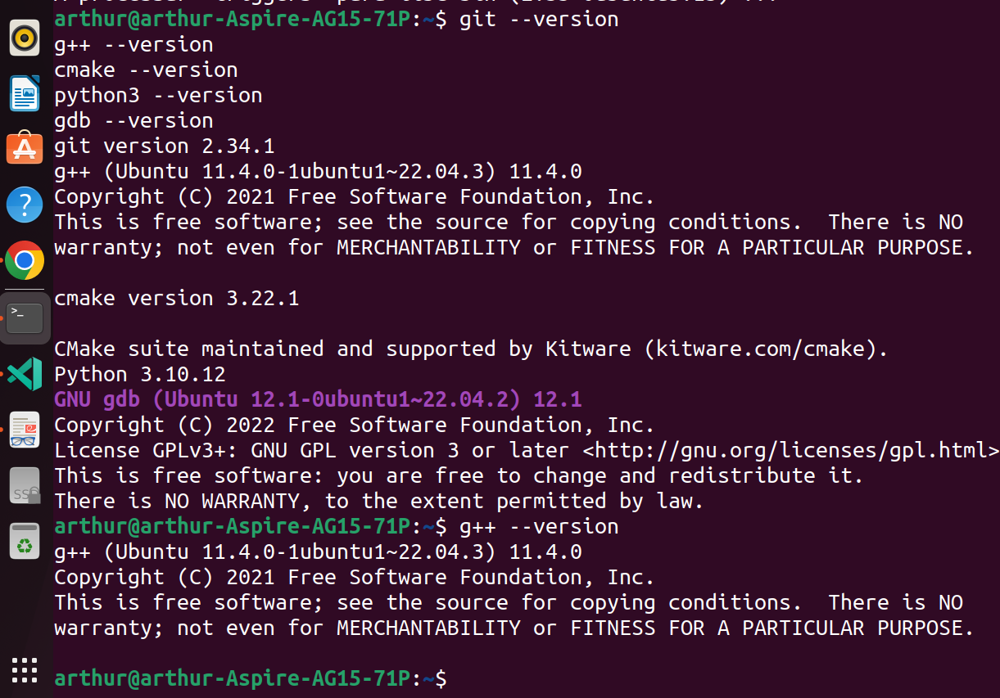

### Checkpoint 2 - Estudo dos conceitos ROS2

Objetivo:
Entender o projeto, baseado em estudos do material disponibilizado e outros meios

Resultado:
- Playlist ROS2 Tutorials - ROS2 Humble For Beginners
- Documentação oficial do ROS2 Humble

Evidência:  
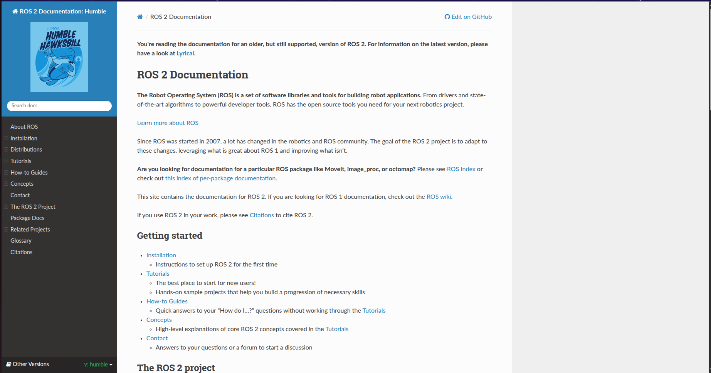

### Checkpoint 3 - Estruturação do projeto

Objetivo:
Estruturar o plano de metas e a metodologia utilizada na resolução do problema 1, baseado no que foi estudado e no tempo disponível

Resultado:
- Criação do github
- Tempo curto -> Entregáveis com data limite
- Priorizar problema 1, mas ter margem para possível problema 2
- Plano escolhido: Princípios de desenvolvimento incremental e arquitetura top-down

Evidência:  
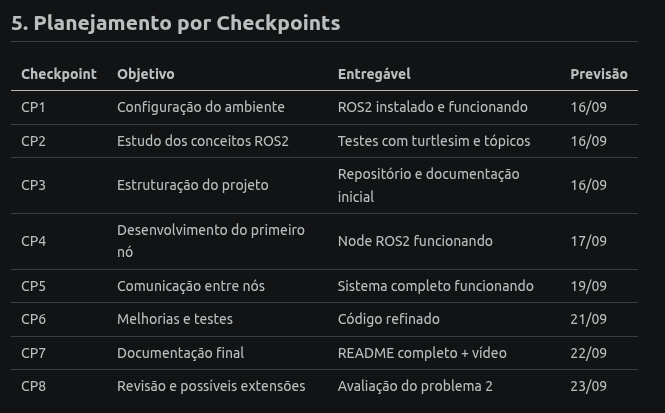

### Checkpoint 4.1 - Desenvolvimento do primeiro nó

Objetivo: Construir o primeiro nó com os conhecimentos adquiridos

Resultado:
- Árvore dos arquivos
- Nó criado: turtle_controller
- Publisher criado: /turtle1/cmd_vel
- Mensagem utilizada: geometry_msgs/Twist
- Frequência de mensagens: 500ms

Evidência:  
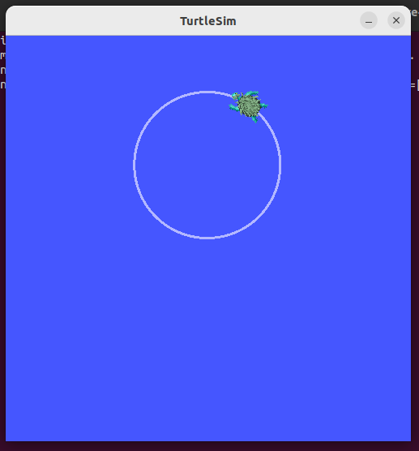

### Checkpoint 4.2 - Correção de erros

Objetivo: Corrigir erros detectados após melhor entendimento do projeto.

Resultado:
- Reconstrução do nó
- Construção dos subscriptions e publishers
- Timer para reenviar send_velocity
- Criação da lógica de giro e movimentação da tartaruga

Evidência:  
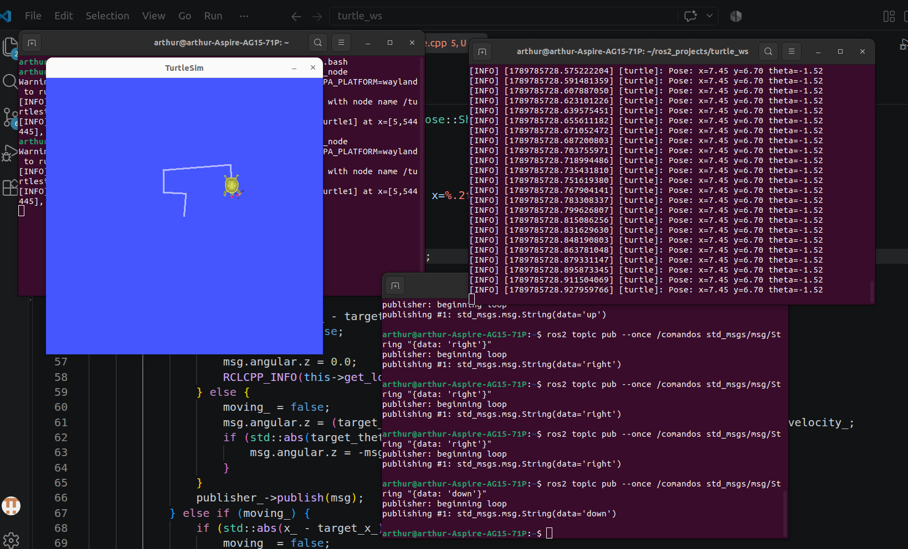

### Checkpoint 4.3 - Alinhamento da movimentação

Objetivo: Corrigir e alinhar o movimento torto da tartaruga

Resultado:
- Uso do client teletransporte
- Lógica para movimento parecer contínuo 
- Escolha de parâmetros corretos

Evidência:  
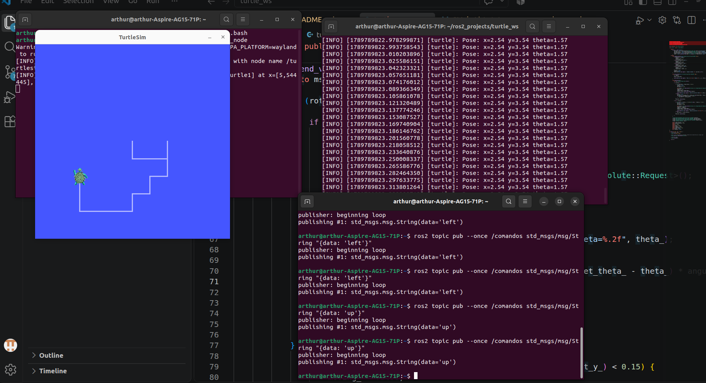

### Checkpoint 5.1 - Comunicação entre nós
Objetivo: Fazer os nós conversarem através do tópico /comandos

Resultado:
- Input dos comandos no send_msg
- Publisher dos comandos em /comandos

Evidência:  
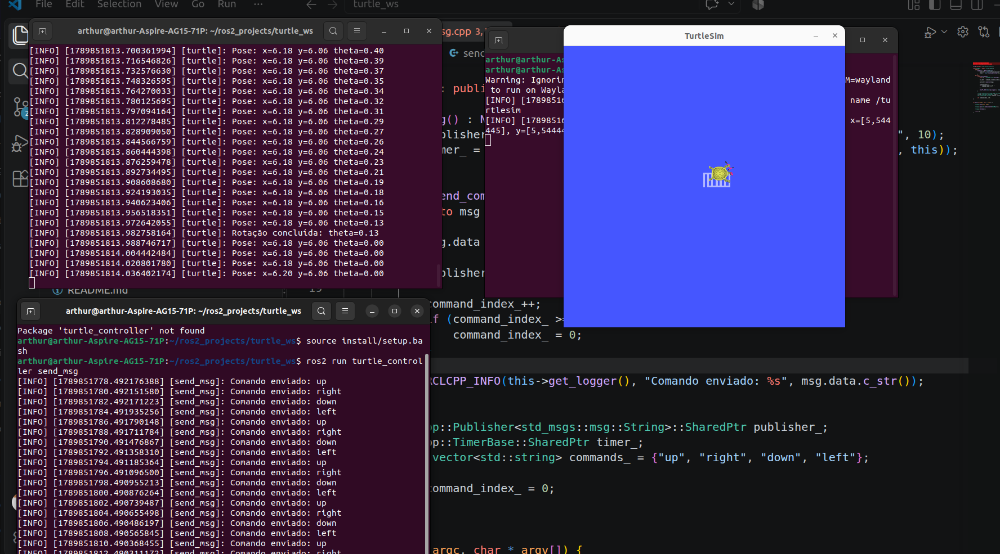

### Checkpoint 5.2 - Conserto de bugs
Objetivo: Barrar que a tartaruga sobrescreva um comando, enquanto finaliza um movimento

Resultado:
- Barreira para não realizar comandos em send_velocity (lock_)
- Retestes para manter movimento contínuo 

Evidência:  
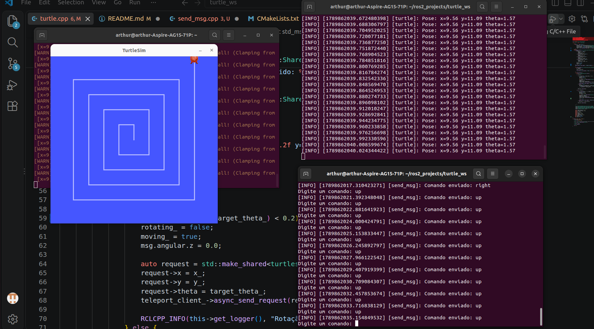

### Checkpoint 5.2 - Fila de comandos
Objetivo: Criar uma fila de comandos para que eles não se perdessem enquanto ocorre o movimento

Resultado:
- command_callback() se tornou apenas útil para receber o comando do tópico e enviar para next_command()
- Nova função (next_command()) para calcular os valores alvos, controlada por lock_
- Fila com os comandos recebidos de send_msg
- Utilização do callback do teleport_client: só segue para próxima instrução quando ter certeza do teleport
- Ajuste do print na tela conforme o pedido no problema

Evidência:  
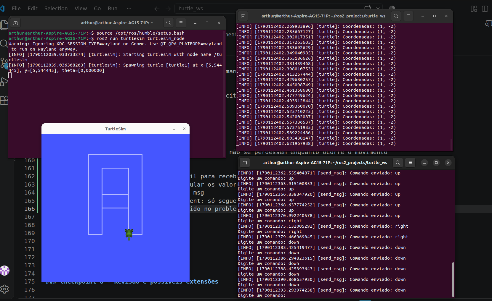

### Checkpoint 6 - Melhoria e testes

Objetivo: Testar e melhorar detalhes importantes para um código confiável e robusto

Resultado:
- Teste do comportamento nas bordas
- Tratamento de comandos que levariam para fora da tela (tais comandos agora são ignorados)
- Falta de sincronia do teleporte com o pose_callback(): atualização das variáveis antes
- Definições de MACROS importantes
- Adição de comentários no código

Evidência:  
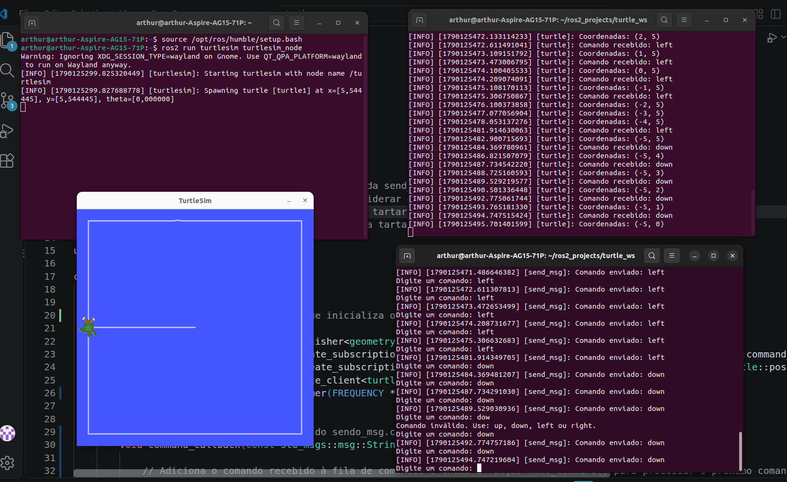

### Checkpoint 7 - Documentação final

Objetivo: Concluir documentação de entrega do projeto

Resultado:
- Pacotes ROS2 .sh
- Como compilar e executar
- Como usar
- Desafios encontrados

Evidência:  
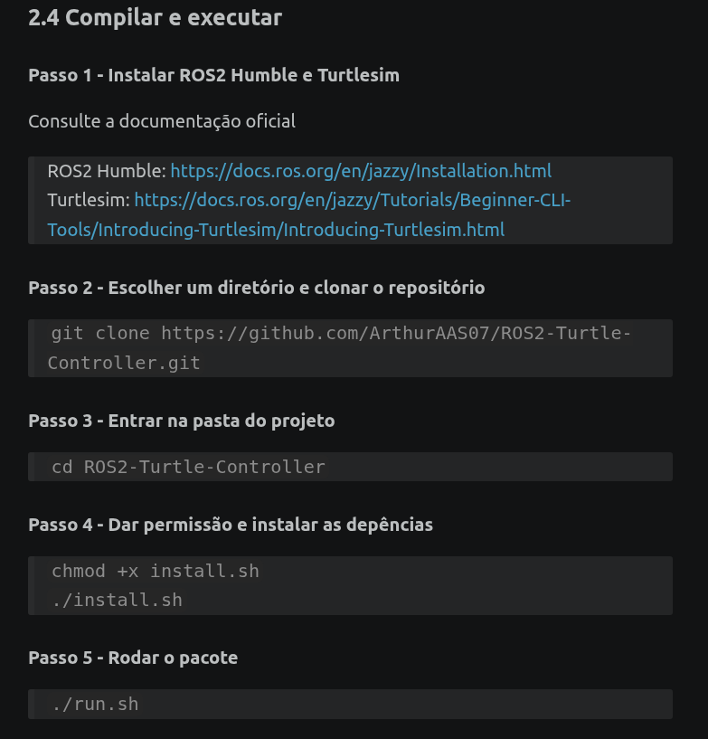

### Checkpoint 8 - Revisão e possíveis extensões

Objetivo: Revisar todo o projeto, verificar erros e analisar problema 2

Resultado:
- Teste em um computador diferente, que não esteja com o ambiente formatado
- Última implementação para manter a fluidez do movimento
- Implementação para uso com Docker
- Problema 2: Provavelmente não haverá tempo suficiente para a conclusão do mesmo, porém decidi iniciá-lo e fazer o máximo possível sem a parte da documentação.

Evidência:
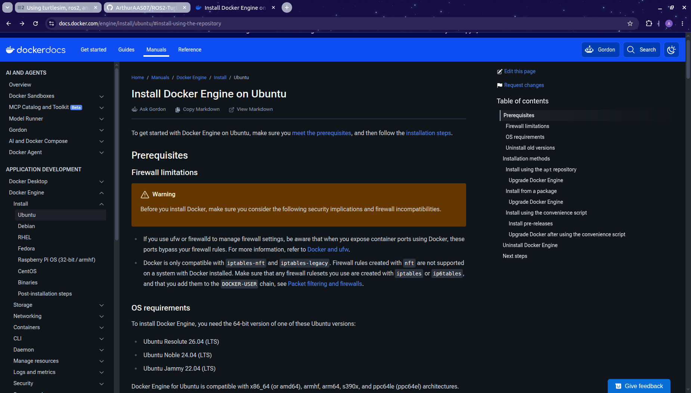

## 7. Desafios Encontrados

#### 1. Instalar o ubuntu
Antes de iniciar efetivamente o desenvolvimento do projeto, foi necessário configurar o ambiente Linux para trabalhar com ROS 2 e C++.

O computador inicialmente já utilizava ubuntu, mas era na versão 26.04 que não tinha compatibilidade com o ROS2 Humble.

Foi preciso adiquirir um pendrive para reinstalar na versão correta e, assim, conseguir utilizar o ambiente correto.

#### 2. Entendimento da arquitetura dos nós

Instalado e configurado tudo, seria necessário o estudo do ROS2, para compreender o que de fato deveria ser feito e, assim, atender os requisitos do projeto.  

Durante os estudos, surgiu a dúvida se o turtlesim deveria ser considerado um dos nós a serem desenvolvidos, ou se o turtle era seria um terceiro nó junto com o send_msg.

Após debates e conversas com membros do Robocin, o nó turtle funciona como controlador intermediário entre o nó send_msg e o turtlesim e que precisaria ser construído.

#### 3. Controle da orientação

Configurações iniciais prontas, já era possível controlar a tarturaga, modificando manualmente constantes como velocidades angular e linear.

Fazer a tartaruga assumir uma orientação específica antes de realizar o movimento foi de fato um desafio. Era necessário ela escolher o menor caminho para realizar a rotação a partir dos parâmetros que já se tinha: a posição atual (recebida do pose_callback) e a posição alvo (calculada pelo comando recebido).

Foi preciso uma equação que traduzisse essa escolha do movimento, simulando vetores. A diferença do ângulo atual com o ângulo alvo, nos daria o quanto ela precisaria se deslocar. Dividindo pelo módulo dessa diferença encontraríamos o sinal da velocidade angular (A direção: horário ou anti-horário). Porém, se a diferença fosse um ângulo maior que 180 graus em módulo, ela escolheu a direção errada e invertia.

#### 4. Movimento impreciso

Durante os testes, um problema foi que a tartaruga não parava exatamente depois de percorrer uma unidade ou depois de rotacionar um ângulo. Ela parava perto das coordenadas, mas nunca permitindo que simulasse um plano cartesiando com números inteiros.

Para resolver isso, foi utilizado o serviço `/turtle1/teleport_absolute` fornecido pelo turtlesim. Quando a tartaruga se aproxima do destino, o controlador interrompe o movimento e utiliza o serviço para colocá-la exatamente na posição calculada. Porém, foi definido um limite de proximidade do alvo para que o movimento parecesse com algo contínuo. Assim, o deslocamento passou a ter uma posição final precisa.

#### 5. Comandos sobrepostos

Cálculos de deslocamento funcionando, tartaruga fazendo movimentos retílinios e perpendiculares, o nó turtle já estava se aproximando do ideal.

Nesse momento surge um problema que parecia ser simples de resolver: novos comandos enviados enquanto a tartaruga ainda estava executando o comando anterior, fazia ela parar o atual (no meio do caminho) e continuar o próximo.

Para evitar que comandos fossem executados simultaneamente, foi implementada a trava lock_, que passou a representar se a tartaruga estava ocupada executando um comando. Assim, impedia que novos comandos passassem por cima de outros em execução. 

#### 6. Fila de comandos

Resolvido a sobreposição de comandos, notou-se que o código descartava o comando recebido se outro estivesse acontecendo. Algo que não batia com os requisitos do projeto.

Para não simplesmente descartar os comandos recebidos enquanto a tartaruga estava ocupada, foi criada uma fila. Os comandos recebidos passaram a ser adicionados nela e uma função extra precisou ser construída para executar o próximo comando. Fazendo com que `command_callback()` apenas recebesse e adicionasse o comando na fila.

#### 7. Comandos fora da tela

Durante novos testes, foi identificado um problema quando a tartaruga atingia às bordas da janela. O programa parava e não executava mais comandos.

Para evitar que um comando impossível fosse executado, foi adicionada uma verificação. O destino é analisado antes de iniciar o movimento, então o comando que levaria a tartaruga para fora da área é descartado e o próximo comando da fila pode ser processado.

#### 8. Sincronização após o teletransporte

Mesmo parecendo tudo ok, foi realizado testes finais para garantir a robustez do programa. 

Foi nesse momento que surge um dos problemas mais sutis do projeto. A posição visual da tartaruga já havia sido corrigida pelo serviço de teletransporte, mas as variáveis internas de posição ainda poderiam conter os valores anteriores. Notou-se que o próximo comando poderia começar antes que o `pose_callback()` retornasse a posição final da tartaruga. O que deixava a posição imprecisa do próximo comando.

Para solucionar esse problema, depois que o teletransporte é concluído, as variáveis internas também são atualizadas. Esse ajuste resolveu os casos em que o próximo destino era calculado a partir de uma posição antiga.

#### 9. Execução dos nós

Inicialmente, cada componente precisava ser executado manualmente em terminais separados. O que dificultava a compilação e execução de alguém que gostaria de testar o projeto.

Foi criado o script `run-turtle-controller.sh` para rodar todos os comandos em um único terminal. Isso permitiu que a execução passasse a ser feita apenas por um comando: `./run-turtle-controller.sh`

#### 10. Separação entre instalação e execução

E se algum computador que baixasse o projeto, não tivesse as dependências necessárias para rodar os nós?

Enquanto o `run-turtler-controller.sh` fica responsável apenas por executar, foi criado o `install.sh` para preparar o ambiente e instalar as dependências necessárias. Posteriormente, uma maneira mais fácil foi adicionada: execução com Docker.

#### 11. Movimentação engasgada

O problema 1 já tinha sido decretado concluído, readme quase pronto, então últimos testes foram feitos.

Por conta do teleporte, uma movimentação em linha reta com mais de um comando repetido, fazia a tartaruga realizar leves travadas no meio do caminho, mesmo a posição estando correta. O travamento no meio do caminho era quase como um "engasgo" apesar de sutil.

Para solucionar esse desafio, foi implementado uma variável inteira chamada `pace_` que representa quantas casas a tartaruga irá se mover. Para cada comando repetido `pace_` é incrementada dentro de um loop até que o próximo comando da fila não seja mais repetido. Esse cálculo é feito antes de definir a posição alvo, que é encontrada somando a posição atual com o `pace_`. Porém, se o alvo ultrapassar o limite da tela ele é recalculado em outro loop e redefinido contando quantos comandos foram desconsiderados.

